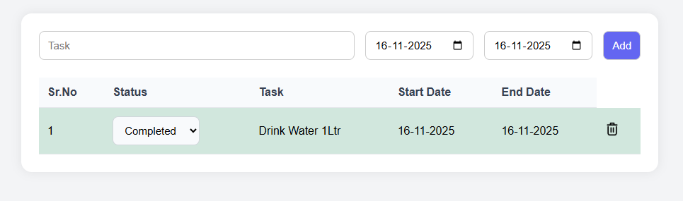

# To-Do Task Tracker with Status 

A clean and interactive To-Do task management web app built using **HTML, CSS, and JavaScript**.  
It allows users to add tasks, set start & end dates, choose task status, delete tasks
---

## 🚀 Features

### ✔ Add Tasks  
- Enter task name  
- Select start & end dates  
- Auto assigns serial number

### ✔ Task Status  
Each task can be marked as:
- **Pending** (light yellow)
- **In Progress** (light blue)
- **Completed** (light green)

### ✔ Auto Row Coloring  
Rows change background color based on the selected status.

### ✔ Delete Task  
Instantly remove any task. Serial numbers update automatically.

---

## 📸 Screenshot  

---

## 🛠 Tech Stack

- **HTML5**
- **CSS3**
- **JavaScript (Vanilla JS)**

No frameworks required.

---

